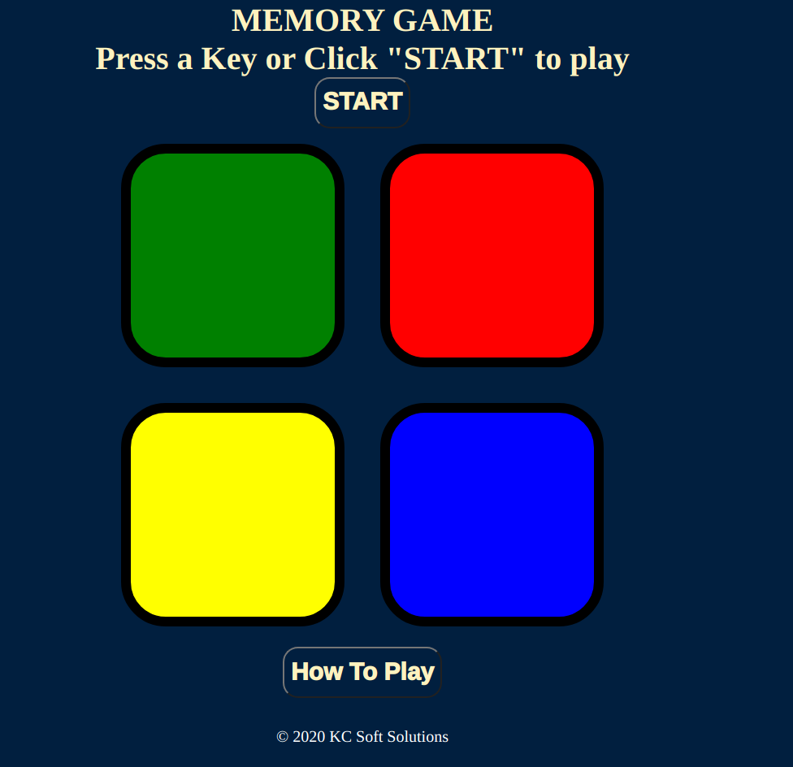

# Memory Game
This is a game built with HTML, CSS, JavaScript, and jQuery. It tests how you can memorize the pattern of blinking of some randomly blinking boxes. It can help you improve your retentive memory.
## Built With

- HTML
- CSS
- JavaScript
- jQuery

## Live Demo

[Live Demo Link](https://henrykc24.github.io/simon-game/)

## Author

👤 **Henry Kc**

- GitHub: [@githubhandle](https://github.com/henrykc24)
- Twitter: [@twitterhandle](https://twitter.com/henrykc24)
- LinkedIn: [LinkedIn](https://linkedin.com/in/henry-kc)

## 🤝 Contributing

Contributions, issues, and feature requests are welcome!

Feel free to check the [issues page](https://github.com/HENRYKC24/simon-game/issues/).

## Show your support

Give a ⭐️ if you like this project!

## Acknowledgments
- I thank in a special way, the Udemy staff for helping me learn all the skills that made the building of this app possible.

## 📝 License

This project is [MIT](./LICENSE) licensed.
